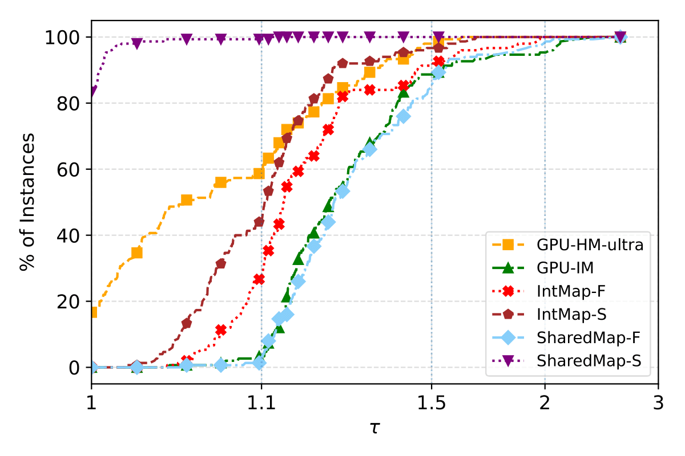
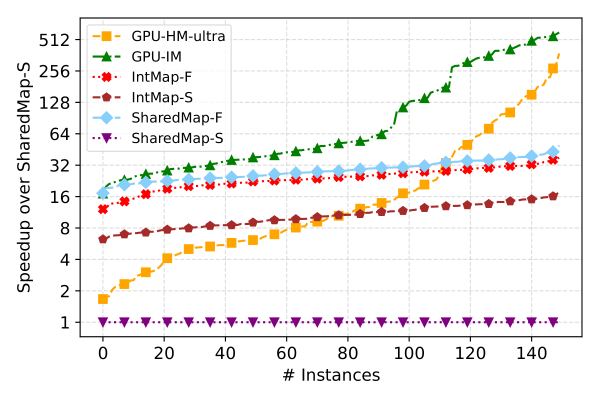

<h1 align="center">GPU-HeiProMap - Heidelberger Process Mapping on GPU</h1>

About GPU-HeiProMap
-----------
GPU-HeiProMap is a GPU-accelerated framework for hierarchical process mapping using Kokkos for performance portability.
The project provides both integrated mapping (IM) and hierarchical multisection (HM) solvers for efficient process mapping in parallel computing environments.

### General Process Mapping
Given 
- Undirected graph $G = (V, E)$ with
  - Vertex weights $c : V \to \mathbb{R_+}$ that represent the workload of task $i$
  - Edge weights $\omega : E \to \mathbb{R_+}$ that represent the amount of data to be transferred between task $i$ and $j$
- Hardware topology matrix $D \in \mathbb{R_+}^{k \times k}$ of $k$ cores
  - An entry $D_{ij}$ represents the cost of sending one unit of data from core $i$ to core $j$

The objective of process mapping is to determine a mapping $\Pi : V \to [k]$ such that
- $\forall i \leq k : \sum_{j \leq n : \Pi(j) = i} c(j) \leq (1 + \epsilon) \frac{c(V)}{k}$
  - no core has too much work (the balancing constraint)
- $J(C, D, \Pi) = \sum_{i, j \leq n} C_{ij} D_{\Pi(i)\Pi(j)}$
  - is minimized
  - $C_{ij} D_{\Pi(i)\Pi(j)}$ is the cost of transferring the data from task $i$ to task $j$ if task $i$ is mapped to core $\Pi(i)$ and task $j$ is mapped to core $\Pi(j)$.

### Hierarchical Process Mapping
In Hierarchical Process Mapping the hardware topology matrix $D$ is described via the hierarchy $H = a_1 : a_2 : \ldots : a_\ell$ and the distance $D = d_1 : d_2 : \ldots : d_\ell$.
This hierarchy specifies that each processor contains $a_1$ PEs, each node contains $a_2$ processors, each rack contains $a_3$ nodes, and so on.
The total number of PEs is $k = \prod_{i=1}^{\ell}a_i$.
Additionally, the sequence $D = d_1 : d_2 : \ldots : d_\ell$ describes the communication cost between the different PEs.
Two PEs on the same processor have distance $d_1$, two PEs on the same node but on different processor have distance $d_2$, two PEs in the same rack but on different nodes have distance $d_3$, and so forth.

### Results
GPU-HeiProMap offers competitive performance compared to state-of-the-art CPU-based mapping algorithms.
Our GPU-HM-ultra algorithm achieves superior solution quality compared to IntegratedMapping while being significantly faster, particularly on large instances.
See the left figure for speedup comparison.

GPU-IM provides exceptional runtime performance, achieving up to 600× speedup over CPU algorithms while maintaining reasonable solution quality.
The right figure shows the performance profile of communication costs across different algorithms.
For detailed algorithm performance and experimental evaluation, we refer to our work...

 

Requirements
-----------
- A Linux operating system (others have not yet been tested).
- A modern compiler that supports C++17, such as `g++`.
- The [cmake](https://cmake.org/) build system (>=3.16).
- CUDA toolkit (for GPU backend).
- OpenMP (for CPU backend).

This project utilizes [Kokkos](https://github.com/kokkos/kokkos), [Kokkos Kernels](https://github.com/kokkos/kokkos-kernels), [KaHIP](https://github.com/KaHIP/KaHIP), and [METIS](https://github.com/KaMinI/METIS) libraries.

Installation
-----------
### Automatic
The script `build.sh` will automatically build the project with the specified backend.

For CUDA backend:
```
./build.sh Cuda
```

For OpenMP backend:
```
./build.sh OpenMP
```

The binary `GPU-HeiProMap` will be present in the `build` folder.

Usage
-----------
Call `GPU-HeiProMap` in the `build` folder:

    ./build/GPU-HeiProMap -g <inpath-graph> -m <outpath-partition> -h <hierarchy> -d <distance> -e <imbalance> -c {IM|HM|HM-ultra} -s <seed>

### Configuration
The available command line arguments and a short description.
You can also use `./GPU-HeiProMap --help` for a list of available parameters.
```
[ -g | --graph      ] <inpath-graph>      : Filepath to a graph in METIS graph format.
[ -m | --mapping    ] <outpath-partition> : Path to the file that will hold the resulting partition.
[ -h | --hierarchy  ] <hierarchy>         : The hierarchy of the supercomputer in the format a:b:c: ... e.g., 4:8:6 .
[ -d | --distance   ] <distance>          : The distance of the processors in the format a:b:c: ... e.g., 1:10:100 .
[ -e | --imbalance  ] <imbalance>         : The maximum allowed imbalance per block e.g., 0.03 allows for a maximum imbalance of 3%.
[ -c | --config     ] <config>            : Which algorithm to use. Allowed values are {IM, HM, HM-ultra}.
[ -s | --seed       ] <seed>              : Seed to diversify partitioning results.

Optional:
[ --statistics      ] <statistics-file>   : Path to output statistics file in JSON format.
```

### Example
The graph `input.graph` is partitioned on a supercomputer with a hierarchy of `4:8:6` with distances `1:10:100` and an allowed imbalance of `3%`.
As the configuration we choose `HM` with seed `42`.
The resulting partition is stored in `output.txt`.

    ./GPU-HeiProMap -g input.graph -m output.txt -h 4:8:6 -d 1:10:100 -e 0.03 -c HM -s 42

## Bugs, Questions, Comments and Ideas

If any bugs arise, questions occur, comments want to be shared, or ideas discussed, please do not hesitate to contact the current repository owner (henning.woydt@informatik.uni-heidelberg.de) or leave a GitHub Issue or Discussion. Thanks!

Licensing
---------
GPU-HeiProMap is free software provided under the MIT License. For more information see the [LICENSE file][LF]. This algorithm is available to everyone, welcoming all who wish to make use of it. If you use GPU-HeiProMap in an academic setting please cite
```
TODO
```

[LF]: https://github.com/HenningWoydt/GPU-HeiProMap/blob/master/LICENSE "License"
